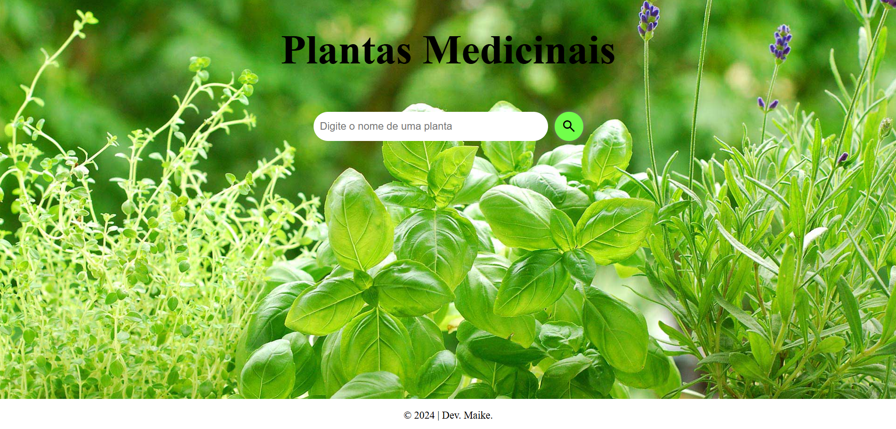

# Projeto de Busca "Plantas Medicinais"

**Descrição**

Projeto que permite usuários pesquisar por Plantas Medicinais, digitanado o nome de um planta no campo de pesquisa.  
Pressionar Enter ou clicar no botão de pesquisa, a aplicação busca por nome ou tags associadas a cada planta.  
Os resultados são exibidos, com o nome da planta, uma breve descrição e um link para mais informações.
* HTML: Estrutura da página web.
* CSS: Estilização da página web.
* JavaScript: Lógica da aplicação, incluindo a função de pesquisa e a manipulação do DOM.
* Google Fonts: Fontes e ícones personalizados para a página.

**Link do projeto**

https://maike-simoncini.github.io/Plantas-Medicinais/

